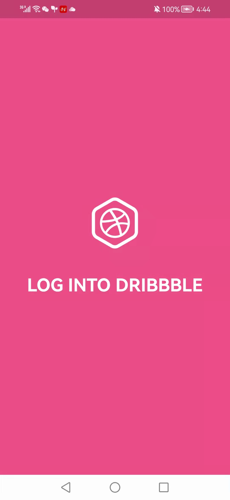
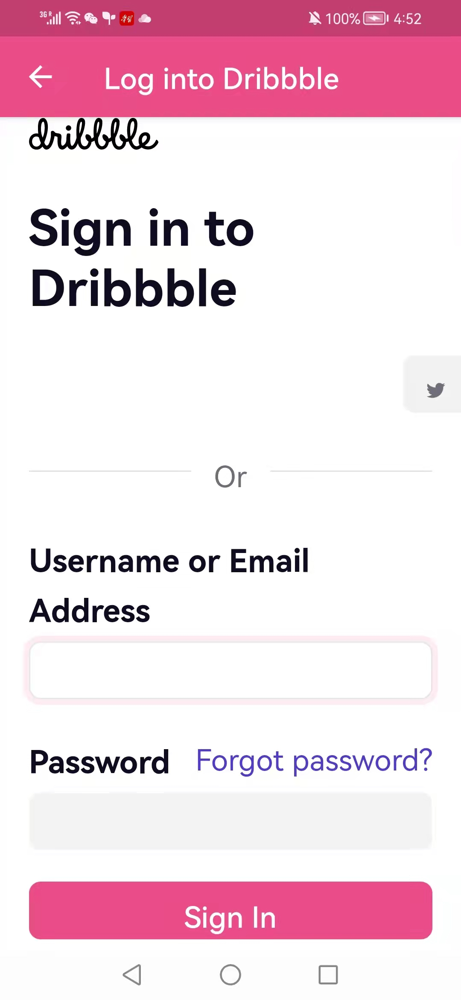
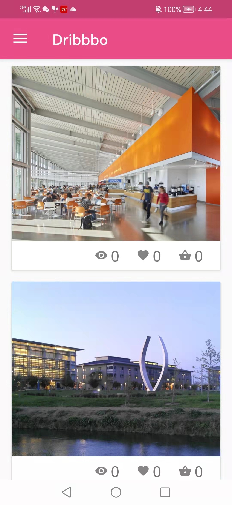
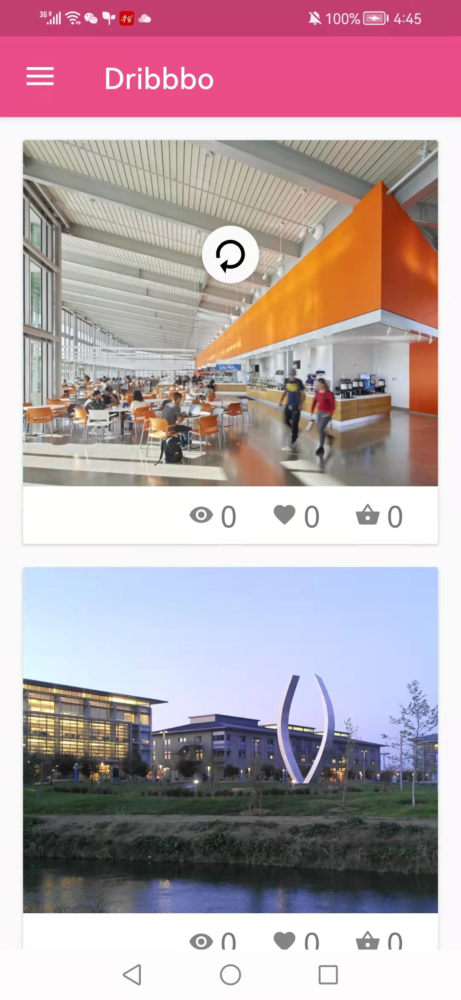
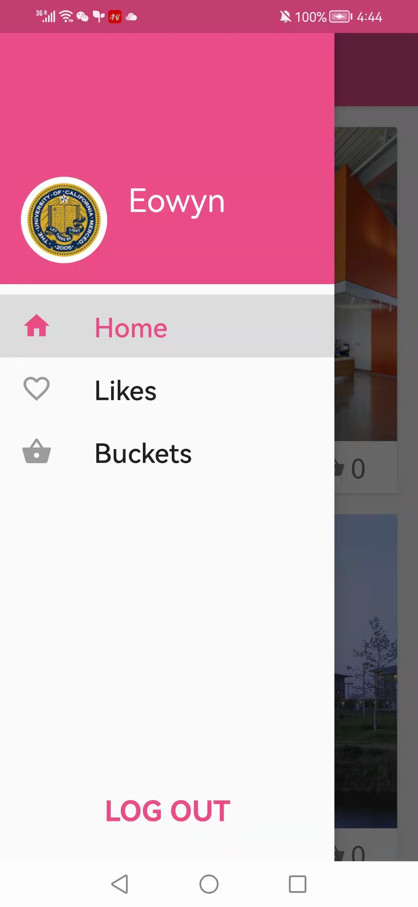
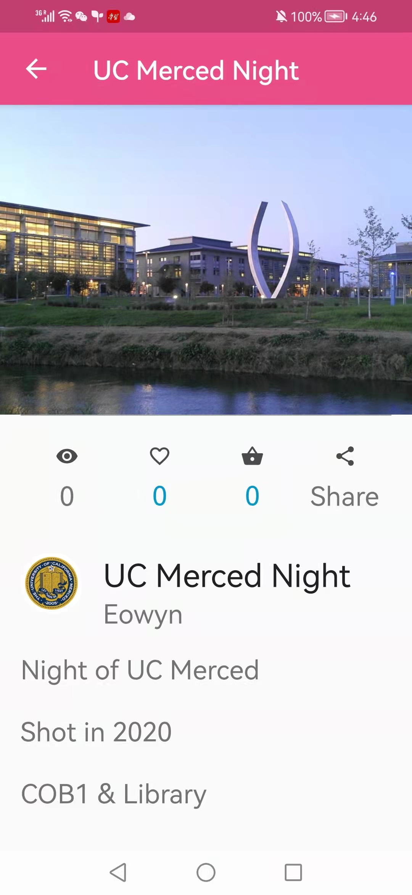
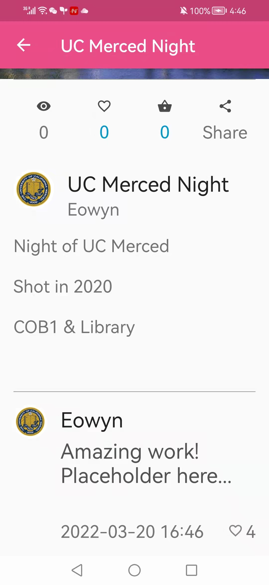
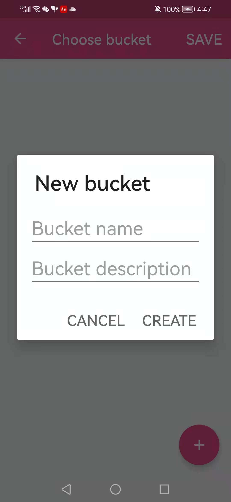

# Dribbbo

    

An Android Client for Dribbble

## Features
* Load shots in an infinite recyclerView
* View account info
* See details of each shot
* View comments for a shot (removed from Dribbble API v2)
* Like/bucket a shot (removed from Dribbble API v2)
* Like a comment removed from Dribbble API v2)
* Create a bucket (removed from Dribbble API v2)

## Libraries
* Okhttp - Http Request
* Gson - Serialization & deserialization
* Picasso - Image loading
* Butterknife - Data binding

## Screenshots

